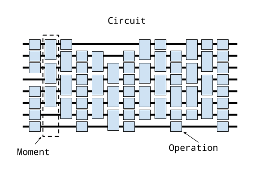

## Circuits

### Conceptual overview

There are two primary representations of quantum programs in Cirq,
each of which are represented by a class: ``Circuit`` and 
``Schedule``.  Conceptually a Circuit object is very closely 
related to the abstract quantum circuit model, while a Schedule 
object is a like the abstract quantum circuit model but includes
detailed timing information.

Conceptually: a ``Circuit`` is a collection of ``Moments``. A ``Moment``
is a collection of ``Operations`` that all act during the same
abstract time slice. An ``Operation`` is a ``Gate`` that operates
on a specific subset of ``Qubits``.


Let's unpack this.

At the base of this construction is the notion of a qubit.  In
Cirq, qubits are represented by subclasses of the ``QubitId``
base class. Different subclasses of ``QubitId`` can be used 
for different purposes.  For example the qubits that Google's
Xmon devices use are often arranged on the vertices of a 
square grid.  For this the the class ``XmonQubit``
subclasses ``QubitId``.   For example, we can create
a 3 by 3 grid of qubits using
```python
qubits = [cirq.google.XmonQubit(x, y) for x in range(3) for y in range(3)]

print(qubits[0])
# prints "(0, 0)"
```

The next level up conceptually is the notion of a ``Gate``.
A ``Gate`` represents a physical process that occurs on a 
``Qubit``.  The important property of a ``Gate`` is that it
can be applied *on* to one or more qubits.  This can be done
via the ``on`` method itself or via ``()`` and doing this
turns the ``Gate`` into an ``Operation``.
```python
# This is an Pauli X gate.
x_gate = cirq.ops.X 
# Applying it to the qubit at location (0, 0) (defined above)
# turns it into an operation.
x_op = x_gate(qubits[0])

print(x_op)
# prints "X((0, 0))"
```

A ``Moment`` is quite simply a collection of operations, each of
which operates on a different set of qubits, and which conceptually
represents these operations as occurring during this abstract time 
slice. The ``Moment`` structure itself is not required to be
related to the actual scheduling of the operations on a quantum 
computer, or via a simulator, though it can be.  For example, here
is a Moment in which Pauli X and a CZ gate operate on three qubits:
```python
cz = cirq.ops.CZ(qubits[0], qubits[1])
x = cirq.ops.X(qubits[2])
moment = cirq.Moment([x, cz])

print(moment)
# prints "X((0, 2)) and ZZ((0, 0), (0, 1))"
```
Note that is not the only way to construct moments, nor even the 
typical method, but illustrates that a ``Moment`` is just a
collection of operations on disjoint sets of qubits. 

Finally at the top level a ``Circuit`` is an ordered series
of ``Moment``s.  The first ``Moment`` in this series is, 
conceptually, contains the first ``Operations`` that will be
applied.  Here, for example, is a simple circuit made up of
two moments
```python
cz01 = cirq.ops.CZ(qubits[0], qubits[1])
x2 = cirq.ops.X(qubits[2])
cz12 = cirq.ops.CZ(qubits[1], qubits[2])
moment0 = cirq.Moment([cz01, x2])
moment1 = cirq.Moment([cz12])
circuit = cirq.Circuit((moment0, moment1))

print(circuit)
# prints a text diagram of the circuit:
# (0, 0): ---Z-------
#            |
# (0, 1): ---Z---Z---
#                |
# (0, 2): ---X---Z---
```
Again, note that this is only one way to construct a ``Circuit``
but illustrates the concept that a ``Circuit`` is an iterable
of ``Moments``.

### Constructing Circuits

Constructing ``Circuits`` as a series of ``Moments`` with
each ``Moment`` being hand-crafted is tedious.  Instead we provide
a variety of different manners to create a ``Circuit``.

One of the most useful ways to construct a ``Circuit`` is by
appending onto the ``Circuit``.

```python
from cirq.ops import CZ, H
q0, q1, q2 = [cirq.google.XmonQubit(i, 0) for i in range(3)]
circuit = cirq.Circuit()
circuit.append([CZ(q0, q1), H(q2)])

print(circuit)
# prints
# (0, 0): ---Z---
#            |
# (1, 0): ---Z---
# 
# (2, 0): ---H---
```
This appended an entire new moment to the qubit, which we can continue to do,
```python
circuit.append([H(q0), CZ(q1, q2)])

print(circuit)
# prints
# (0, 0): ---Z---H---
#            |
# (1, 0): ---Z---Z---
#                |
# (2, 0): ---H---Z---
```

In these two examples, we have appending full moments, what happens when we
append all of these at once?
```python
circuit = cirq.Circuit()
circuit.append([CZ(q0, q1), H(q2), H(q0), CZ(q1, q2)])

print(circuit)
# prints
# (0, 0): ---Z---H---
#            |
# (1, 0): ---Z---Z---
#                |
# (2, 0): ---H---Z---
```
We see that here we have again created two ``Moments``. How did ``Circuit``
know how to do this?  ``Circuit's`` ``append`` method (and its cousin
``insert``) both take an argument called the ``InsertStrategy``.  By default
the ``InsertStrategy`` is ``NEW_THEN_INLINE``. 

#### InsertStrategies

``InsertStrategy`` defines how ``Operations`` are placed in a ``Circuit``
when requested to be inserted at a given location. Here a *location* is
identified by the index of the ``Moment`` (in the ``Circuit``) where 
the insertion is requested to be placed at (in the case of ``append``
this means inserting at the ``Moment`` at an index one greater than
the maximum moment index in the ``Circuit``). There are four such
strategies: ``EARLIST``, ``NEW``, ``INLINE`` and ``NEW_THEN_INLINE``.

``EARLIST`` is define as

> EARLIEST: Scans backward from the insert location until a moment 
with operations touching qubits affected by the operation to insert
is found. The operation is added into the moment just after that 
location.

For example, if we first create an ``Operation`` in a single moment,
and then use ``EARLIEST`` the ``Operation`` can slide back to this
first ``Moment`` if there is space:
```python
from cirq import InsertStrategy
circuit = cirq.Circuit()
circuit.append([CZ(q0, q1)])
circuit.append([H(q0), H(q2)], strategy=InsertStrategy.EARLIEST)

print(cirq._circuits)
# prints
# (0, 0): ---Z---H---
#            |
# (1, 0): ---Z-------
# 
# (2, 0): ---H-------
```
After creating the first momemnt with a ``CZ`` gate, the second append
usese the ``EARLIST`` strategy.  The ``H`` on ``q0`` cannot slide back, 
while the ``H`` on ``q2`` can and so ends up in the first ``Moment``.

Contrast this with the ``NEW`` ``InsertStrategy``:
> NEW: Every operation that is inserted is created in a new moment.
```python
circuit = cirq.Circuit()
circuit.append([H(q0), H(q1), H(q2)], strategy=InsertStrategy.NEW)

print(cirq._circuits)
# prints
# (0, 0): ---H-----------
#
# (1, 0): -------H-------
#
# (2, 0): -----------H---
```
Here every operator processed by the append ends up in a new moment.
``NEW`` is most useful when you are inserting a single operation and
don't want it to interfere with other ``Moments``.  

Another strategy is ``INLINE``:

> INLINE: Attempts to add the operation to insert into the moment 
just before the desired insert location. But, if there's already
an existing operation affecting any of the qubits touched by the
operation to insert, a new moment is created instead.

```python
circuit = cirq.Circuit()
circuit.append([CZ(q2, q3)])
circuit.append([CZ(q0,q1), H(q2), H(q0)], strategy=InsertStrategy.INLINE)

print(cirq._circuits)
# prints
# (0, 0): -------Z---H---
#                |
# (1, 0): ---Z---Z-------
#            |
# (2, 0): ---Z---H-------
```
After an initial ``CZ`` between the second and third qubit, we try to
insert 3 ``Operations``.  We see that the ``CZ`` on the first two 
qubits and the ``H`` on the third qubit are inserted into the new
``Moment``, but then the insert of ``H`` on the first qubit cannot 
be insert into this ``Moment``, so a new ``Moment`` is created.

Finally we turn to the default strategy: 

> NEW_THEN_INLINE: Creates a new moment at the desired insert
location for the first operation, but then switches to inserting 
operations according to INLINE.

```python
circuit = cirq.Circuit()
circuit.append([H(q0)])
circuit.append([CZ(q1,q2), H(q0)], strategy=InsertStrategy.NEW_THEN_INLINE)

print(cirq._circuits)
# prints
# (0, 0): ---H---H---
#
# (1, 0): -------Z---
#                |
# (2, 0): -------Z---
```
The first append creates a single moment with a ``H`` on the first qubit.
Then the append with the ``NEW_THEN_INLINE`` strategy begins by
inserting the ``CZ`` in a new ``Moment`` (the ``NEW`` in ``NEW_THEN_INLINE``).
Subsequent appending is done ``INLINE`` so the next ``H`` on the first qubit
is appending in the just created ``Moment``.

Here is a helpful diagram for the different ``InsertStrategies``

TODO(dabacon): diagram.


#### Patterns for Arguments to Append and Insert 

Above we have used a series of ``append``s with a list of different
``Operations`` we are adding to the circuit.  But the argument where
we have supplied a list can also take more than just ``list`s.

Example:
```python
def my_layer():
  yield CZ(q0, q1)
  yield [H(q) for q in (q0, q1, q2)]
  yield [CZ(q1, q2)]
  yield [H(q0), [CZ(q1, q2)]]  

circuit = cirq.Circuit()
circuit.append(my_layer())

for x in my_layer():
    print(x.gate)
# prints
# ZZ((0, 0), (1, 0))
# [Operation(H, (XmonQubit(0, 0),)), Operation(H, (XmonQubit(1, 0),)), Operation(H, (XmonQubit(2, 0),))]
# [Operation(ZZ, (XmonQubit(1, 0), XmonQubit(2, 0)))]
# [Operation(H, (XmonQubit(0, 0),)), [Operation(ZZ, (XmonQubit(1, 0), XmonQubit(2, 0)))]]

print(cirq._circuits)
# prints 
# (0, 0): ---Z---H---H-------
#            |
# (1, 0): ---Z---H---Z---Z---
#                    |   |
# (2, 0): -------H---Z---Z---
```
Recall that in Python functions that have a ``yield`` are *generators*.
Generators are functions that act as *iterators*.  Above we see
that we can iterate over ``my_layer()``.  We see that when we do this
each of the ``yields`` produces what was yielded, and here these are
``Operations``, lists of ``Operations`` or lists of ``Operations``
mixed with lists of ``Operations``. But when we pass this iterator 
to the append method, something magical happens.  ``Circuit`` is
able to flatten all of these an pass them as one giant list to
``append`` (this also works for ``insert``).  

> **Technical aside:** The above idea uses a concept we call an
``OP_TREE``.  An ``OP_TREE`` is not a class, but a contract. The
basic idea is that, if the input can be iteratively 
flattened into a list of operations, then the input is an
``OP_TREE``.  
  
A very nice pattern emerges from this structure: define
*generators* for sub-circuits, which can vary by size
or ``Operation`` parameters. 
