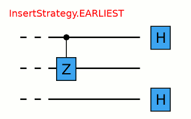
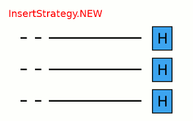
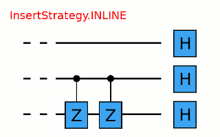
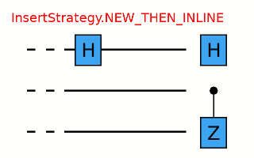

## Circuits

### Conceptual overview

There are two primary representations of quantum programs in Cirq, each of
which are represented by a class: `Circuit` and `Schedule`. 
Conceptually a Circuit object is very closely related to the 
abstract quantum circuit model, while a Schedule object is
like the abstract quantum circuit model but includes detailed timing
information.

Conceptually: a `Circuit` is a collection of ``Moments``. A
`Moment` is a collection of ``Operations`` that all act during
the same abstract time slice. An `Operation` is a
some effect that operates on a specific subset of ``Qubits``,
the most common type of `Operation` is a `GateOperation`.


Let's unpack this.

At the base of this construction is the notion of a qubit.  In
Cirq, qubits are represented by subclasses of the `QubitId`
base class. Different subclasses of `QubitId` can be used
for different purposes.  For example the qubits that Google's
Xmon devices use are often arranged on the vertices of a
square grid.  For this the class `GridQubit`
subclasses `QubitId`.   For example, we can create
a 3 by 3 grid of qubits using
```python
qubits = [cirq.GridQubit(x, y) for x in range(3) for y in range(3)]

print(qubits[0])
# prints "(0, 0)"
```
The next level up conceptually is the notion of a `Gate`.
A `Gate` represents a physical process that occurs on a
``Qubit``.  The important property of a `Gate` is that it
can be applied *on* to one or more qubits.  This can be done
via the `Gate.on` method itself or via ``()`` and doing this
turns the `Gate` into a `GateOperation`.
```python
# This is an Pauli X gate. It is an object instance.
x_gate = cirq.X
# Applying it to the qubit at location (0, 0) (defined above)
# turns it into an operation.
x_op = x_gate(qubits[0])

print(x_op)
# prints "X((0, 0))"
```
A `Moment` is quite simply a collection of operations, each of
which operates on a different set of qubits, and which conceptually
represents these operations as occurring during this abstract time
slice. The `Moment` structure itself is not required to be
related to the actual scheduling of the operations on a quantum
computer, or via a simulator, though it can be.  For example, here
is a Moment in which Pauli X and a CZ gate operate on three qubits:
```python
cz = cirq.CZ(qubits[0], qubits[1])
x = cirq.X(qubits[2])
moment = cirq.Moment([x, cz])

print(moment)
# prints "X((0, 2)) and CZ((0, 0), (0, 1))"
```

Note that is not the only way to construct moments, nor even the
typical method, but illustrates that a `Moment` is just a
collection of operations on disjoint sets of qubits.

Finally at the top level a `Circuit` is an ordered series
of `Moment`s.  The first `Moment` in this series is,
conceptually, contains the first ``Operations`` that will be
applied.  Here, for example, is a simple circuit made up of
two moments
```python
cz01 = cirq.CZ(qubits[0], qubits[1])
x2 = cirq.X(qubits[2])
cz12 = cirq.CZ(qubits[1], qubits[2])
moment0 = cirq.Moment([cz01, x2])
moment1 = cirq.Moment([cz12])
circuit = cirq.Circuit((moment0, moment1))

print(circuit)
# prints the text diagram for the circuit:
# (0, 0): ───@───────
#            │
# (0, 1): ───@───@───
#                │
# (0, 2): ───X───@───
```
Again, note that this is only one way to construct a `Circuit`
but illustrates the concept that a `Circuit` is an iterable
of ``Moments``.

### Constructing circuits

Constructing `Circuits` as a series of `Moments` with each
`Moment` being hand-crafted is tedious. Instead we provide a
variety of different manners to create a `Circuit`.

One of the most useful ways to construct a `Circuit` is by
appending onto the `Circuit` with the
`Circuit.append` method.
```python
from cirq.ops import CZ, H
q0, q1, q2 = [cirq.GridQubit(i, 0) for i in range(3)]
circuit = cirq.Circuit()
circuit.append([CZ(q0, q1), H(q2)])

print(circuit)
# prints
# (0, 0): ───@───
#            │
# (1, 0): ───@───
#
# (2, 0): ───H───
```

This appended an entire new moment to the qubit, which we can continue to do,
```python
circuit.append([H(q0), CZ(q1, q2)])

print(circuit)
# prints
# (0, 0): ───@───H───
#            │
# (1, 0): ───@───@───
#                │
# (2, 0): ───H───@───
```

In these two examples, we have appending full moments, what happens when we
append all of these at once?
```python
circuit = cirq.Circuit()
circuit.append([CZ(q0, q1), H(q2), H(q0), CZ(q1, q2)])

print(circuit)
# prints
# (0, 0): ───@───H───
#            │
# (1, 0): ───@───@───
#                │
# (2, 0): ───H───@───
```
We see that here we have again created two ``Moments``. How did
`Circuit` know how to do this? ``Circuit's`` `Circuit.append` 
method (and its cousin `Circuit.insert`) both take an argument called 
the `InsertStrategy`. By default the `InsertStrategy` is 
`InsertStrategy.NEW_THEN_INLINE`.

### InsertStrategies

`InsertStrategy` defines how ``Operations`` are placed in a
`Circuit` when requested to be inserted at a given location.
Here a `location` is identified by the index of the `Moment` (in
the `Circuit`) where the insertion is requested to be placed at
(in the case of `Circuit.append` this means inserting at the `Moment`
at an index one greater than the maximum moment index in the
`Circuit`). There are four such strategies:
`InsertStrategy.EARLIEST`, `InsertStrategy.NEW`,
`InsertStrategy.INLINE` and
`InsertStrategy.NEW_THEN_INLINE`.

`InsertStrategy.EARLIEST` is defined as
> `InsertStrategy.EARLIEST`: Scans backward from the insert
> location until a moment with operations touching qubits affected by the
> operation to insert is found. The operation is added into the moment just
> after that location.

For example, if we first create an `Operation` in a single moment,
and then use `InsertStrategy.EARLIEST` the `Operation` can slide back to this
first `Moment` if there is space:

```python
from cirq.circuits import InsertStrategy
circuit = cirq.Circuit()
circuit.append([CZ(q0, q1)])
circuit.append([H(q0), H(q2)], strategy=InsertStrategy.EARLIEST)

print(circuit)
# prints
# (0, 0): ───@───H───
#            │
# (1, 0): ───@───────
#
# (2, 0): ───H───────
```

After creating the first moment with a `CZ` gate, the second
append uses the `InsertStrategy.EARLIEST` strategy. The
`H` on ``q0`` cannot slide back, while the `H` on
``q2`` can and so ends up in the first `Moment`.

Contrast this with the `InsertStrategy.NEW` `InsertStrategy`:
> `InsertStrategy.NEW`: Every operation that is inserted is
> created in a new moment.
```python
circuit = cirq.Circuit()
circuit.append([H(q0), H(q1), H(q2)], strategy=InsertStrategy.NEW)

print(circuit)
# prints
# (0, 0): ───H───────────
#
# (1, 0): ───────H───────
#
# (2, 0): ───────────H───
```

Here every operator processed by the append ends up in a new moment.
`InsertStrategy.NEW` is most useful when you are inserting a single operation and
don't want it to interfere with other ``Moments``.

Another strategy is `InsertStrategy.INLINE`:
> `InsertStrategy.INLINE`: Attempts to add the operation to
> insert into the moment just before the desired insert location. But, if
> there's already an existing operation affecting any of the qubits touched
> by the operation to insert, a new moment is created instead.
```python
circuit = cirq.Circuit()
circuit.append([CZ(q1, q2)])
circuit.append([CZ(q1, q2)])
circuit.append([H(q0), H(q1), H(q2)], strategy=InsertStrategy.INLINE)

print(circuit)
# prints
# (0, 0): ───────H───────
#
# (1, 0): ───@───@───H───
#            │   │
# (2, 0): ───@───@───H───
```

After two initial `CZ` between the second and third qubit, we try
to insert 3 `H` ``Operations``. We see that the `H` on the first
qubit is inserted into the previous `Moment`, but the `H` on the second and third
qubits cannot be inserted into the previous `Moment`, so a new `Moment` is
created.

Finally we turn to the default strategy:
> `InsertStrategy.NEW_THEN_INLINE`: Creates a new moment at the
> desired insert location for the first operation, but then switches to
> inserting operations according to `InsertStrategy.INLINE`.

```python
circuit = cirq.Circuit()
circuit.append([H(q0)])
circuit.append([CZ(q1,q2), H(q0)], strategy=InsertStrategy.NEW_THEN_INLINE)

print(circuit)
# prints
# (0, 0): ───H───H───
#
# (1, 0): ───────@───
#                │
# (2, 0): ───────@───
```

The first append creates a single moment with a `H` on the first
qubit. Then the append with the `InsertStrategy.NEW_THEN_INLINE`
strategy begins by inserting the `CZ` in a new
`Moment` (the `InsertStrategy.NEW` in
`InsertStrategy.NEW_THEN_INLINE`). Subsequent appending is done
`InsertStrategy.INLINE` so the next `H` on the first
qubit is appending in the just created `Moment`.

Here are some helpful animations illustrating the different `InsertStrategies`.






### Patterns for Arguments to Append and Insert

Above we have used a series of `Circuit.append` calls with a list
of different ``Operations`` we are adding to the circuit. But the argument
where we have supplied a list can also take more than just `list`
values.

Example:
```python
def my_layer():
    yield CZ(q0, q1)
    yield [H(q) for q in (q0, q1, q2)]
    yield [CZ(q1, q2)]
    yield [H(q0), [CZ(q1, q2)]]

circuit = cirq.Circuit()
circuit.append(my_layer())

for x in my_layer():
    print(x)
# prints
# CZ((0, 0), (1, 0))
# [cirq.H.on(cirq.GridQubit(0, 0)), cirq.H.on(cirq.GridQubit(1, 0)), cirq.H.on(cirq.GridQubit(2, 0))]
# [cirq.CZ.on(cirq.GridQubit(1, 0), cirq.GridQubit(2, 0))]
# [cirq.H.on(cirq.GridQubit(0, 0)), [cirq.CZ.on(cirq.GridQubit(1, 0), cirq.GridQubit(2, 0))]]

print(circuit)
# prints
# (0, 0): ───@───H───H───────
#            │
# (1, 0): ───@───H───@───@───
#                    │   │
# (2, 0): ───────H───@───@───
```

Recall that in Python functions that have a ``yield`` are *generators*.
Generators are functions that act as *iterators*. Above we see that we can
iterate over ``my_layer()``. We see that when we do this each of the
``yields`` produces what was yielded, and here these are ``Operations``,
lists of ``Operations`` or lists of ``Operations`` mixed with lists of
``Operations``. But when we pass this iterator to the append method,
something magical happens. `Circuit` is able to flatten all of
these an pass them as one giant list to `Circuit.append` (this
also works for `Circuit.insert`).
> The above idea uses a concept we call an ``OP_TREE``. An ``OP_TREE`` is
> not a class, but a contract. The basic idea is that, if the input can be
> iteratively flattened into a list of operations, then the input is an
> ``OP_TREE``.

A very nice pattern emerges from this structure: define
*generators* for sub-circuits, which can vary by size
or `Operation` parameters.

Another useful method is to construct a `Circuit` fully formed
from an ``OP_TREE`` via the static method `Circuit.from_ops`
(which takes an insertion strategy as a parameter):

```python
circuit = cirq.Circuit.from_ops(H(q0), H(q1))
print(circuit)
# prints
# (0, 0): ───H───
#
# (1, 0): ───H───
```

### Slicing and Iterating over Circuits

``Circuits`` can be iterated over and sliced. When they are iterated
over each item in the iteration is a moment:
```python
circuit = cirq.Circuit.from_ops(H(q0), CZ(q0, q1))
for moment in circuit:
    print(moment)
# prints
# H((0, 0))
# CZ((0, 0), (1, 0))
```
Slicing a `Circuit` on the other hand, produces a new
`Circuit` with only the moments corresponding to the slice:
```python
circuit = cirq.Circuit.from_ops(H(q0), CZ(q0, q1), H(q1), CZ(q0, q1))
print(circuit[1:3])
# prints
# (0, 0): ───@───────
#            │
# (1, 0): ───@───H───
```

Especially useful is dropping the last moment (which are often just
measurements): ``circuit[:-1]``, or reversing a circuit:
``circuit[::-1]``.
