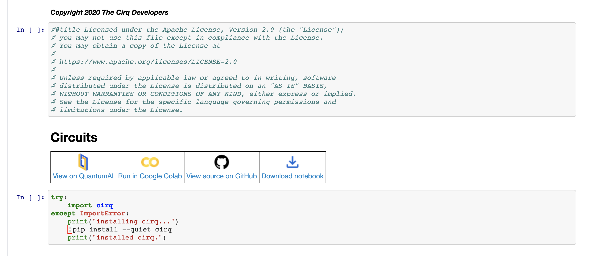

# Notebooks guidelines

Our guides and tutorials are frequently written using iPython Notebooks. The notebooks require specific formatting, are continuously tested (when possible) and we have a specific process to manage the lifecycle of a notebook before and after a Cirq release.

## Formatting

Formatting is easy, the script `check/nbformat` should tell you if your notebooks are formatted or not.
You can apply the changes in one go with `check/nbformat --apply`. It is recommended to add this to your [git pre-commit hook](https://git-scm.com/book/en/v2/Customizing-Git-Git-Hooks), to save feedback time and CI resources.

## Output cells

Output cells typically should not be saved in the notebook. They will be generated for the final site.
The exception to this rule are notebooks with external dependencies ([see below](#notebooks-with-external-dependencies)).

## Header

We also expect a standard header to be included in all of our notebooks:
- the links to colab, github and the main site ([quantumai.google/cirq](https://quantumai.google/cirq))
- optional package installation (you can assume Colab dependencies exist)

Example header:

You can use [our template notebook](https://storage.googleapis.com/tensorflow_docs/Cirq/docs/_template.ipynb) to get started - please remember to change the `$$$REPLACE_WITH_TITLE$$$`, `$$$REPLACE_WITH_SITE_URL$$$` and `$$$REPLACE_WITH_NOTEBOOK_PATH$$$` placeholders.

Note that notebooks can expect to have typical `pip` python packages available
to them within colab environments, but the user may need to install them in the
case of Jupyter notebooks.  Notebook code, especially setup code, is not
expected to be able to run as-is outside of a notebook environment.  However,
making code snippets portable between environments is preferable when
feasible to do so.

## Editing the tree nav on the site: _book.yaml

If you are placing a guide or a tutorial on the site, please make sure you add an entry to the right place in the nav tree in [docs/_book.yaml](https://github.com/quantumlib/Cirq/blob/master/docs/_book.yaml).

## Testing

Those notebooks that don't have any external dependencies (e.g. API calls, authentication) are tested on a continuous basis.
See the [`dev_tools/notebooks`](https://github.com/quantumlib/Cirq/tree/master/dev_tools/notebooks) directory for the two tests:
- [notebook_test.py](https://github.com/quantumlib/Cirq/blob/master/dev_tools/notebooks/notebook_test.py) - to test notebooks against the current branch
- [isolated_notebook_test.py](https://github.com/quantumlib/Cirq/blob/master/dev_tools/notebooks/isolated_notebook_test.py) - to test notebooks against the latest released version of Cirq.

In order to speed up the execution of these tests an auxiliary file may be supplied which performs substitutions on the notebook to make it faster (for example it is often useful
to reduce the number of repetitions in sampling from a simulator).

To do this, for a notebook file notebook.ipynb, one can supply a file notebook.tst which contains the substitutes.
The substitutions are provided in the form `pattern->replacement` where the pattern is what is matched and will be replaced.
While the pattern is compiled, it is considered best practice to not use complicated regular expressions.
Lines in this file that do not have `->` are ignored.  Note that because the pattern is
compiled, it may be necessary to escape the pattern, however it is best to try to avoid
such complicated expressions.

## Notebooks with external dependencies

Unfortunately we have no easy way to test notebooks with external API dependencies, e.g. cirq_google's Engine API.
These notebooks should be excluded from both tests.  This can be done by adding
them to `SKIP_NOTEBOOKS` within the file `dev_tools/notebooks/notebook_test.py`.

External dependencies, for these purposes, are calls to external services and
APIs, such as vendor endpoints for cloud services.  These can also include
external downloads, such as installing packages from unknown debian
repositories, which may be blocked for security reasons.

The site that generates the outputs for notebooks also can't handle external dependencies.

Thus, for notebooks with external dependencies, **all cells must have their outputs saved in the notebook file**. This ensures that the site pipeline will skip these notebooks.

## Lifecycle

You should configure notebooks differently depending on whether they rely on features in the pre-release build of cirq or not.

### Pre-release notebooks

When you introduce a notebook that depends on pre-release features of Cirq, make sure to

 - mark the notebook at the top that `Note: this notebook relies on unreleased Cirq features. If you want to try these feature, make sure you install cirq via pip install cirq --pre`.
 - use `pip install cirq —pre`  in the installation instructions
 - make sure [notebook_test.py](https://github.com/quantumlib/Cirq/blob/master/dev_tools/notebooks/notebook_test.py) covers the notebook
 - exclude the notebook from the [isolated_notebook_test.py](https://github.com/quantumlib/Cirq/blob/master/dev_tools/notebooks/isolated_notebook_test.py) by adding it to `NOTEBOOKS_DEPENDING_ON_UNRELEASED_FEATURES`

### Stable notebooks

When you introduce a notebook that only uses already released features of Cirq, make sure to
 - use `pip install cirq` (NOT `pip install cirq --pre`)
 - ensure the notebook is not excluded from either [notebook_test.py](https://github.com/quantumlib/Cirq/blob/master/dev_tools/notebooks/notebook_test.py) or [isolated_notebook_test.py](https://github.com/quantumlib/Cirq/blob/master/dev_tools/notebooks/isolated_notebook_test.py)  (except if the notebook has external dependencies, in which case you should exclude this from both!)

### Release

At release time, we change all the **pre-release notebooks** in bulk:
 - remove the pre-release notices
 - change `pip install cirq —pre` to `pip install cirq`
 - remove the exclusions in [isolated_notebook_test.py](https://github.com/quantumlib/Cirq/blob/master/dev_tools/notebooks/isolated_notebook_test.py) by making `NOTEBOOKS_DEPENDING_ON_UNRELEASED_FEATURES=[]`

As all the notebooks have been tested continuously up to this point, the release notebook PR should pass without issues.

### Modifying stable notebooks

Modifications to stable notebooks are tested with dev_tools/notebooks/isolated_notebook_test.py.
However, a stable notebook will become a pre-release notebook if a modification introduces dependency on unreleased features. In this case, follow the pre-release notebook guidelines accordingly.
