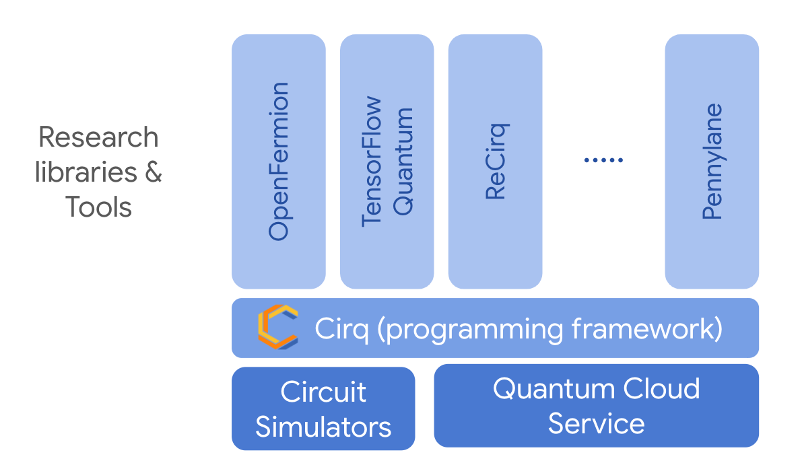

The following document provides an ecosystem overview of how the various tools compatible with Cirq can work together to enable quantum computing research.

* **Research Libraries and Tools:** Libraries and tools used for researching new quantum algorithms and designing and preparing experiments on quantum devices.

* **Cirq**: A framework specifically for programming noisy intermediate quantum computers.

* **Quantum Cloud Services:** Cirq can connect to a variety of quantum cloud services. Behind each cloud service, quantum algorithms run on either a quantum processor or simulator.

* **Quantum Circuit Simulators:** Cirq is compatible with a number of quantum circuit simulators that can run either locally or in a distributed fashion.

# Research libraries and tools 

## Algorithm libraries and experiments

|Name|Main sponsor|Description|
|--- |--- |--- |
|[OpenFermion](https://github.com/quantumlib/OpenFermion)|Google|An open-source algorithms library for developing new quantum chemistry and materials simulation algorithms|
|[TensorFlow Quantum](https://tensorflow.org/quantum)|Google|An open-source algorithms library for developing new quantum machine learning algorithms|
|[ReCirq](https://github.com/quantumlib/ReCirq)|Google|An open-source repository of example experiments, tools, and tutorials for running experiments on Google’s Quantum Computing Service|
|[Forge](https://forge.qcware.com/)|QCWare|A proprietary library for domain-specific quantum algorithms and applications|
|[Pennylane](https://pennylane.ai/)|Xanadu|An open-source library for quantum machine learning with TensorFlow, PyTorch, or NumPy|

## Development tools

|Name|Main sponsor|Description|
|--- |--- |--- |
|[MITIQ](https://github.com/unitaryfund/mitiq)|Unitary Fund|An open-source library for error mitigation|
|[Orquestra](https://www.zapatacomputing.com/orquestra/)|Zapata|A proprietary workflow management tool for quantum computing|
|[pyGSTi](https://www.pygsti.info/)|Sandia National Labs|An open-source library for modeling and characterizing noisy quantum information processors|
|[QUEKO](https://github.com/UCLA-VAST/QUEKO-benchmark)|UCLA|An open-source tool to generate benchmarks with the known optimal solutions|
|[tket](https://cqcl.github.io/pytket/build/html/index.html#)|Cambridge Quantum|A proprietary and platform agnostic SDK for circuit optimisation, compilation and noise mitigation|
|[True-Q](https://trueq.quantumbenchmark.com/)|Quantum Benchmark|A proprietary library for assessing and optimizing quantum hardware and algorithm performance.|

## Supported quantum cloud services

|Company|Description|
|--- |--- |
|[Google QCS](https://cirq.readthedocs.io/en/stable/docs/google/concepts.html)|A quantum computing service based on superconducting qubits|
|[Alpine Quantum Technologies](https://cirq.readthedocs.io/en/latest/docs/tutorials/aqt/getting_started.html)|A quantum computing service based on ion traps|
|[Pasqal](https://cirq.readthedocs.io/en/stable/docs/pasqal/getting_started.html)|A quantum cloud service based on neutral atoms|

## High performance quantum circuit simulators

|Name|Main sponsor|Description|
|--- |--- |--- |
|[qsim](https://github.com/quantumlib/qsim)|Google|An open-source, high performance circuit simulator for Schrödinger simulations|
|[qflex](https://github.com/ngnrsaa/qflex)|NASA|An open-source, high performance circuit simulator for Feynman-based simulations optimized for GPUs|
|[quimb](https://github.com/jcmgray/quimb)|Johnny Gray|An open-source, high performance circuit simulator using tensor-networks|
|[qulacs](https://github.com/qulacs/cirq-qulacs)|Quansys|An open-source, high performance circuit simulator for Schrödinger simulations|

