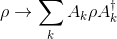
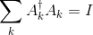
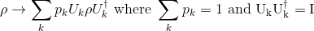
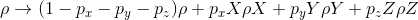

## Noise

For simulation, it is useful to have `Gate`s that enact noisy quantum evolution.
Cirq supports modeling noise via *operator sum* representations of
noise (these evolutions are also known as quantum operations, quantum
dynamical maps, or superoperators).  This formalism models evolution of the
density matrix via

Where Ak are *Krauss* operators. These operators are not
necessarily unitary and must satisfy
the trace preserving property

As a noisy channel, Krauss operators are not unique. For more details of these
operators see [John Preskill's notes](http://www.theory.caltech.edu/people/preskill/ph219/chap3_15.pdf).

### Magic methods

A `Gate` can represent an operator sum representation by supporting the
`channel` protocol.  Alternatively, for channels that represent probabilistic
mixtures of unitaries, one can implement the `mixture` protocol.

#### cirq.channel and def _channel_

To represent an operator sum evolution, a `Gate` should implement the
`SupportsChannel` protocol. To do this, the `Gate` should implement the
`_channel_(self) -> Sequence[np.ndarray]:` method. This method should return
the sequence of `numpy` matrices corresponding to the Krauss operators. The
basis in which this matrix is expressed is always implicit with respect to
the object being called. For example, in GateOperations, these matrices
must be ordered with respect to the list of qubits that the channel is
applied to. The qubit-to-amplitude order mapping matches the
ordering of `numpy.kron(A, B)`, where `A` is a qubit earlier in the list
than the qubit `B`.

If one has defined `_channel_`, then that `Gate` and any `GateOperation`
that uses that gate can be used as an argument to `cirq.channel` and
`cirq.channel` will return this sequence of matrices.

Besides objects that support `_channel_`, `cirq.channel` will also fall
back to other objects that can be interpreted as channels. For example, if a
channel is a probabilistic mixture of unitary gates (see below), then
`cirq.channel` will fall back to seeing if the object supports `_mixture_`.
If `_mixture_` is not supported, then `cirq.channel` checks to see if
`_unitary_` is supported.

In addition to supporting `_channel_`, objects that are channels should also
implement `_has_channel_(self) -> bool` to return True. This method is
used to determine whether an object has a `_channel_` or not without
having to do the potentially expensive creation of the matrices for the
channel.

#### cirq.mixture, cirq.mixture_channel, and def _mixture_

Some channels can be interpreted as probabilistically selecting between
different unitary evolutions.

In this case, it is possible to perform
Monte Carlo simulations of these gates using a wave function based simulator
(and not a density matrix based simulator).  Instead of
implementing the `SupportsChannel` protocol, one should implement the
`SupportsMixture` protocol. To do this, one should implement the
`_mixture_(self) -> Sequence[Tuple[float, np.ndarray]]` protocol.  This
returns a sequence of tuples. The first element of each tuple is the
probability of the unitary and the second element is the unitary. Like
the `_channel_` method described above, the basis for these matrices is
implicit with respect to the object being called. One should also make
`_has_mixture_` return `True` to indicate to callers that the object supports
the mixture protocol. If one wants to get the mixture channel directly, one
can call `cirq.mixture_channel`.

### Common Channels

Cirq supports many commonly used quantum channels out of the box, see
[`ops/common_channels.py`](https://github.com/quantumlib/Cirq/blob/master/cirq/ops/common_channels.py).

#### AsymmetricDepolarizingChannel, DepolarizingChannel, BitFlipChannel, and PhaseFlipChannel

The asymmetric depolarizing channel represents probabilistically selecting
one of three Pauli gates to apply or doing nothing to the state. This is
implemented via a `_mixture_` method so that a Monte Carlo simulation with a
wave function simulator can be used.

This channel implements the evolution

Here px is the probability that the X Pauli gate is applied and
no other gate is applied, and similarly for py and pz.

A particular case of the asymmetric depolarizing channel is the case where
each of the different Paulis occur with the same probability. This is
encapsulated in the `DepolarizingChannel` gate, which takes a probability `p`
such that each Pauli gate occurs with probability `p/3`.

To construct channels, useful helpers are provided `cirq.asymmetric_depolarize`
and `cirq.depolarize`.

Another common case is when only a Pauli X (bit flip) can occur, or
when only a Pauli Y (phase flip) can occur. These correspond to
`BitFlipChannel` and `PhaseFlipChannel` with helpers `cirq.bit_flip` and
`cirq.phase_flip`.

#### GeneralizedAmplitudeDampingChannel and AmplitudeDampingChannel

The generalized amplitude damping channel models the effect of energy
dissipation to a surrounding environment as well as dephasing that
does not exchange energy. The amplitude damping channel only models
dissipation of energy to a surrounding environment. Cirq has implementations
of both of these channels. The generalized amplitude damping channel
corresponds to

Where &#947; is the probability of the interaction being dissipative and
`p` is the probability that the qubit and environment exchange energy. The
amplitude damping channel corresponds to `p=1`.

Cirq provides the helpers `cirq.generalized_amplitude_damp` and
`cirq.amplitude_damp` to construct these noisy gates.
