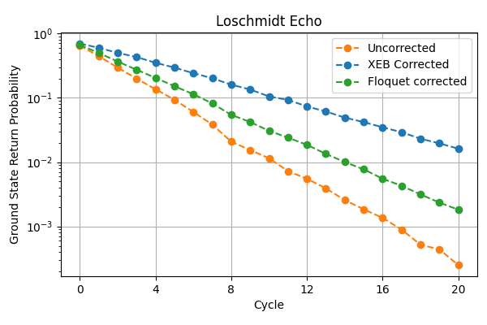
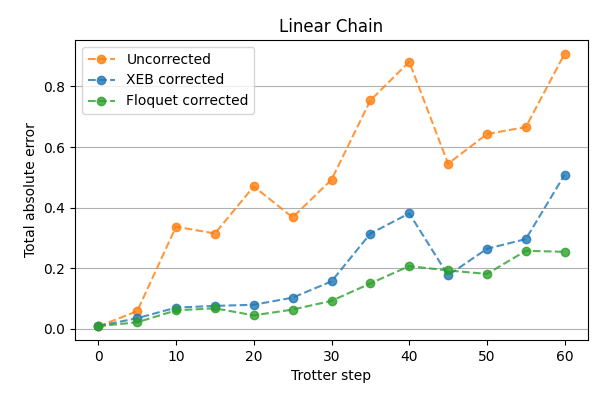

# Calibration FAQ

**Warning:** The circuit-specific calibration API is an advanced alpha feature. Best practices may change in the future.

## What is calibration?

Calibration is a technique to reduce systematic errors in quantum circuits.  This technique aims to adjust for gate errors
in moments that contain only two-qubit gates. Circuit specific calibrations optimizes gate error for specific circuits.
When executing a circuit with multiple simultaneous two-qubit gates, the actual effect may be different than the intended
effect due to various sorts of errors, such as drift or cross-talk.  Though one may request a `cirq.SQRT_ISWAP` gate, the quantum state
may be affected by a unitary effect that is close to, but not exactly, a `cirq.SQRT_ISWAP`.  Characterization attempts to identify
the actual effect of the gates using repeated expressions of the two-qubit layer.  Once parameters are identified that more
closely resemble the actual effect, some errors can be compensated for by using Z gates to correct phases before and after
each gate. This will improve the accuracy of the overall moment without adding additional duration to the circuit (the newly
added Z gates will be merged with the already existing Z gates after sending circuits to the QCS.)

The [two supported techniques](./calibration_api.ipynb) are [Floquet calibration](./floquet_calibration_example.ipynb)
and [XEB calibration](./qcvv/xeb_calibration_example.ipynb), both of which are advanced alpha features.

## What is the Floquet calibration protocol?

Floquet calibration protocol allows for determining the parameters of entangling gates rapidly and precisely, which unlocks
the ability to compensate for systematic gate errors caused by drifts and fluctuations. Like XEB, it is robust to state
preparation and measurement errors. Floquet calibration is based on the idea that an entangling gate can be determined by
the eigenvalues of the composite gates consisting of the entangling gate and different single-qubit gates, where each choice
of single-qubit gates provides a snapshot of the entangling gate. There are two stages in Floquet calibration, characterization
and compensation. Currently, only the single-qubit Z phases before and after the two-qubit gate are compensated. The
compensation pulses are combined with the gate pulses; therefore, they do not increase the circuit implementation time. In
structured circuits, two-qubit gates in the same moment should be calibrated simultaneously to combat crosstalks if possible.
Floquet calibration is really fast, which allows one to calibrate multiple moment structures within budgeted time.

## Which gates are supported by Floquet and XEB calibrations?

Floquet calibrations specified by `cirq_google.FloquetPhasedFSimCalibrationOptions` supports characterization of four out of
five unitary parameters θ, ζ, γ and φ of the `cirq.FSim(theta=pi / 4, phi=0)` gate (inverse of the `cirq.SQRT_ISWAP` gate)
presently.  The Cirq compiler can use Z gates to compensate for the ζ, χ, γ parameters.  The compiler can also compile `cirq.SQRT_ISWAP`
gate into its inverse so that it can be used in calibrated circuits and take advantage of the characterization.

The XEB calibration specified by `cirq_google.LocalXEBPhasedFSimCalibrationOptions` supports `cirq.SQRT_ISWAP` and its inverse.
It characterizes all five unitary parameters and also provides the fidelity estimates for each of the calibrated gates. However,
the compiler can only adjust for three of the five parameters by inserting Z gates.

This version of XEB is using the client-side Cirq characterization backed by
`cirq.experiments.xeb_fitting.characterize_phased_fsim_parameters_with_xeb_by_pair` and when used directly it can support
arbitrary gates, including composite ones. However, the compiler which adjusts for ζ, χ, γ angles available in cirq_google
package supports only `cirq.SQRT_ISWAP` with its inverse and `cirq_google.SYC`.

Floquet calibration does not yet support microwave gates, this functionality is planned.

## How do I calibrate a circuit using Floquet or XEB calibrations?

Refer to the [Calibration API](./calibration_api.ipynb) tutorial for an overview, and see the
[Floquet calibration example](./floquet_calibration_example.ipynb) and [XEB calibration example](./qcvv/xeb_calibration_example.ipynb)
for detailed steps on example circuits with benchmarks.

This is in principle a three-step process which consists of the following three steps:

1. Analyzing the circuit:   To analyze the circuit, use `cirq_google.prepare_characterization_for_moments` with
    `cirq_google.FloquetPhasedFSimCalibrationOptions` (for Floquet) or `cirq_google.LocalXEBPhasedFSimCalibrationOptions`
    (for XEB).  This function will analyze the circuit and figure out which moments will need to be characterized.  It will
    identify moments with the same two-qubit structure so that they can be characterized together.

2. Characterizing the layer: The previous step will generate a list of characterization requests (one for each unique layer).
    The next step is to call `cirq_google.run_calibrations`.  This will invoke the API and send the requests to the device
    to be characterized.

3. Compile the circuit: The final step is to use the results of the characterization to re-compile the circuit to compensate
    for ζ, χ and γ angles.  This can be done with the help of `cirq_google.make_zeta_chi_gamma_compensation_for_moments` function.

## When should Floquet or XEB Calibrations be used?

Both calibrations are primarily focused on decreasing the effects of two sources of errors: calibration drifts and cross-talk
errors. Those errors are not uniform across the chip and vary in magnitude between qubits and device calibrations. The
circuit-specific calibrations should be used in situations when achieving the best performance out of Google’s hardware is more
important than using extra time on the device for the characterizations.

The ζ, χ and γ parameters of the `cirq.PhasedFSimGate` unitary are subject to drifts that range in frequency from seconds to hours.
They can be automatically compensated by adjusting the single-qubit Z rotations. This functionality is provided for the supported
circuits through the `cirq_google.make_zeta_chi_gamma_compensation_for_moments` or `cirq_google.make_zeta_chi_gamma_compensation_for_operations`
functions.

The types of cross-talk that are captured by circuit specific calibrations influence the θ, ζ, χ and γ unitary angles the most. Similarly to drift errors; ζ, χ and γ can be compensated by adjusting the single-qubit Z rotations.

The parameter φ is usually stable in time and is loosely dependent on the user circuit. However, its value might vary between interacting pairs and undergo rapid changes occasionally.

For reference, the PhaseFSimGate unitary is represented by:

```text
    [[1,                       0,                       0,            0],
     [0,    exp(-iγ - iζ) cos(θ), -i exp(-iγ + iχ) sin(θ),            0],
     [0, -i exp(-iγ - iχ) sin(θ),    exp(-iγ + iζ) cos(θ),            0],
     [0,                       0,                       0, exp(-2iγ-iφ)]].
```

## What is the difference between the user-triggered calibrations (Floquet or XEB) and the maintenance calibration?

The maintenance or device calibration is performed every few days by the device support team and is focused on low-level
maintenance like adjusting qubit frequencies or profiling the pulse shape of each gate. This maintenance is performed
holistically for the entire chip and is mostly focused on a good performance of the chip in general. This maintenance
benchmarks performance on isolated gates or fully-layered simultaneous gates that may or may not resemble the circuits
specific in your execution.

The user-triggered calibrations issued through the [Calibration API](./calibration_api.ipynb) are designed for circuit-specific
execution to capture both drift and cross-talk errors. They can be triggered just before the user circuit execution, in order to
reduce the effect of drift. They can also be triggered on very specific qubits that match the user’s executed circuits in order to
reduce cross-talk errors. The user-triggered calibrations do not change the qubit frequency or pulse shapes at this moment; they
focus only on compensating the gate unitary parameters.

## What is the difference between Floquet and XEB calibrations?

Floquet and XEB have the same purpose of characterizing gates but differ in their specific methods.

XEB characterization is based on scrambling gates with random single-qubit rotations, which include the microwave X and Y gates.
Based on many different realizations, the unitary parameters which maximize the fidelity of each gate can be learned. Floquet
calibration is more targeted and assumes certain noise characteristics to learn each parameter. The current Floquet calibration
uses only Z gates during the repetition phase of the experiment.

Because of its nature, XEB is easily adapted to various gates and currently it supports all the angles of √iSWAP gate. Floquet
characterization doesn’t cover all the angles: the angle χ is not supported currently. It also follows that XEB requires more
quantum samples and classical computational resources to estimate the unitary parameters; to reach a comparable precision of
estimation, XEB is about an order of magnitude slower compared to the Floquet calibration. Therefore if you either have limited
time on the processor (e.g. Open-swim time) or the observed fluctuations is longer than the timescale of the calibration, one
may want to use Floquet calibration.

The other significant difference is concerned with microwave gates.  [Physical Z Gate](https://quantumai.google/cirq/google/devices#one_qubit_gates)
(`cirq.PhasedXZGate`) can add additional sources of error that may be captured by XEB characterization. XEB calibration is more applicable to circuits that alternate single-qubit and two-qubit layers due to the similarity between the random XEB circuits and executed circuits. Floquet calibration may be more applicable to the circuits with two-qubit gates and Z gates only.

Note that, once the gates have been characterized, both methods share the same compilation/compensation method.

## I have many circuits to calibrate, how do I speed it up?

If the circuits have a similar structure (compatible moments), then they can probably share the same characterization. To
prepare such a characterization request, it needs to be passed as initial argument to the `cirq_google.prepare_characterization_for_moments`
method:

```python
circuit_to_compensate = []
requests = []
for circuit in circuits:
    circuit_to_compensate, requests = prepare_characterization_for_moments(
        circuit, options, initial=requests
    )
    circuits_to_compensate.append(circuit_to_compensate)
```

Alternatively the same result can be achieved by passing a list of circuits to the `cirq_google.prepare_characterization_for_circuits_moments`
helper method:

```python
circuits_to_compensate, requests = prepare_characterization_for_circuits_moments(
    circuits, options
)
```

Please note that the software is smart enough to select the minimum number of characterizations for a batch of circuits.

To control the granularity further, the `cirq_google.prepare_characterization_for_moments` function has a `merge_subsets`
option. This option is by default set to true which indicates that whenever two moments appear, and one of the moments is
a subset of another moment then they will be merged together and characterized as a moment which is the larger of the two.
This choice leads to a smaller number of necessary layers, but some of the issues related to crosstalk are not captured.
For the highest accuracy, it might be desired to characterize each unique moment separately with the merge_subsets option
set to false.


Note that in this image the qubit lines run from top to bottom instead of left to right (the usual in Cirq).

## What is the difference between moment-oriented and operations-oriented calibrations?

There are two kinds of calibrations available in `cirq_google.calibrations` module:

* moment oriented with `cirq_google.prepare_characterization_for_moments` and `cirq_google.make_zeta_chi_gamma_compensation_for_moments`
  functions, and
* operations oriented with `cirq_google.prepare_floquet_characterization_for_operations` and `cirq_google.make_zeta_chi_gamma_compensation_for_operations`.

The moment-oriented characterizations analyse the circuit moment by moment in order to account for cross-talks. When some
gate on a particular set of qubits appears in two different moments, it will be characterized twice in two layers with different
gates acting in parallel. On current devices the cross-talk effects are very strong on certain qubit configurations.

There is an option to ignore the moment restrictions with the operations based calibration. In this mode, the moment structure
is ignored and the circuit is analyzed on a per-operation basis, a single pair appears in at most one layer being characterized.
With the current planar architecture, this bounds a maximum number of different characterizations for an arbitrary number of circuits
by four. This option might be useful to quickly check for the state of a device or benchmark particular qubit configurations before
doing the actual experiment.

For example, if you have a circuit on a line of 5 qubits, there are 4 unique two-qubit gates and 7 unique moments with different
combinations of two-qubit gates. If you use `cirq_google.prepare_floquet_characterization_for_operations`, this will result
in 2 characterizations (since 2 unique gates can be put into a single moment) . If you use `cirq_google.prepare_characterization_for_moments`
with `merge_subsets=False` this will result in 7 characterizations.

## What if the compensation based on single-qubit phases is not enough?

The provided compilation `cirq_google.make_zeta_chi_gamma_compensation_for_moments` uses Z gates to compensate for errors.
For the `cirq.SQRT_ISWAP` gate this does not affect duration of a circuit because the added Z gates are merged with the
already-existing Z gate pulses after submitting circuits to server. This compilation method that uses just Z gates can only
compensate for 3 angles: ζ, χ and γ.

Compensation for the remaining two parameters θ and φ can’t be realized in a simple way.  Some experiments can be modified
to adjust to these errors by modifying circuit construction, compilation, or problem statement, but this must be handled by the
user and cannot be done automatically.

For these advanced use cases, the `cirq_google.run_calibrations` method can be called directly with a list of
`cirq_google.PhasedFSimCalibrationRequest` objects.  This will allow you to call the Calibration API directly to specify
customized layers for characterizations.

```python
@dataclasses.dataclass(frozen=True)
class PhasedFSimCalibrationRequest(abc.ABC):
    pairs: Tuple[Tuple[Qid, Qid], ...]   # a list of pairs of in a single moment to characterize
    gate: Gate                                    # desired gate (must be cirq.ISWAP ** -0.5 for Floquet)
    options: PhasedFSimCalibrationOptions  # detailed adjustments
               # either FloquetPhasedFSimCalibrationOptions or LocalXEBPhasedFSimCalibrationOptions
```

After triggering this calibration with the `cirq_google.run_calibrations` method, the `cirq_google.PhasedFSimCalibrationResult`
is returned with a parameters field that contains the unitary parameters of all the requested gates. The object also contains
additional execution metadata which might be useful.

See also ["How to compensate for the parasitic c-phase φ angle?"](#how_to_compensate_for_the_parasitic_c-phase_φ_angle) below.

## Floquet calibration fails with a message: Readout errors above the tolerance for qubit pairs (...), what can be done?

This is an automated check performed before the actual Floquet calibration on QCS used to detect if a particular gate did not
drift too much outside of reasonable error levels. When the check fails, the following exception is reported:

```python
PhasedFSimCalibrationError: Readout errors above the tolerance for qubit pairs ((8, 3), (8, 4))
```

Probably the most desired action would be to try to avoid this particular pair. For many qubits, this might be a temporary
effect and repeating the experiment at a later time might help.

The automated check can also be relaxed by setting the `readout_error_tolerance` parameter to a value higher than `0.4` in
`cirq_google.FloquetPhasedFSimCalibrationOptions`. (A value of `1.0` disables the readout checks entirely).

## How should I validate that Floquet or XEB calibration is working?

One mechanism for determining if your circuit performance is improving would be to run Floquet / XEB calibration on your
actual circuit and compare the results to your noiseless simulation. This however could be difficult and expensive as your
circuit size increases.

Alternatively, one can run a Loschmidt echo with random circuits using Floquet calibration, and see that the overall return
probability is higher than before. Even though the Loschmidt Echo random circuit may look very different from the actual circuit
you are running, the gate compensations should result in a decent improvement in the return probabilities.

See [this tutorial for an example of using Loschmidt echo](../tutorials/google/echoes.ipynb). Here is an example of applying Floquet and XEB
corrections to a 16-site Loschmidt echo circuit (higher is better):



Here is another example of applying calibrations to a linear chain circuit that contains only Z gates and `cirq.SQRT_ISWAP` gates
(lower is better):



## How should I test Floquet / XEB Calibration on my circuit?

* First, you should have a circuit whose performance needs to be improved.  Defining a metric of success is important to
  clarify whether the procedure was successful. (E.g., for the case of the Fermi-Hubbard experiment, calculating the
  spin-charge density of each site).

* Make sure you get a reservation budget and then
  [reserve a block of time using the cloud console](https://console.cloud.google.com/quantum/processors/) to test various
  permutations of your circuit. Expect that each calibration would take about 1.6s per qubit and 28s per moment of additional
  time to your regular circuit runs.

* Run the circuit against both a perfect simulator and a coherent noise simulator to get valid baselines for performance.

* Using [this tutorial for Floquet calibration](./floquet_calibration_example.ipynb) as a guide, introduce Floquet characterization
  and resulting compensating Z phase gates into your circuit, and compare the results with Floquet calibration turned on and turned off.

In order to ensure an apt comparison, it is important to keep the following points in mind:

* Make sure you pick your qubits wisely.
  - Use parallel readout heatmap to avoid any obviously broken qubits.
  - Use two-qubit error heatmaps to choose various patches of qubits with good two-qubit gate performance.
  - Use a mini-benchmark circuit to sanity check both qubit choice and basic circuit design.
  - If in doubt, [use parallel XEB to check for issues like drift / TLS](../tutorials/google/identifying_hardware_changes.ipynb).

* Start small with a low number of qubits (e.g. 2 qubits, with 5-10 layers of 2 qubit gates), and increase the number of qubits
  and gate depth.
* Do not increase the gate depth past the T1 time of the qubits.
* Use out of the box re-compilation first. If that doesn’t work, then try custom recompilation.

For a complete set of best practices, check the following [guide](../google/best_practices.ipynb).

## How to compensate for the parasitic c-phase φ angle?

The `cirq_google.SQRT_ISWAP` gate ideally should have a zero value of the φ angle. In practice the ZZ interaction always
happens during the gate execution, and all the two-qubit gates attain some unwanted parasitic c-phase angle φ. The typical
values for √iSWAP gate are about 0.13 which might be significant for certain applications, especially when circuits
of large depth are executed that accumulate errors caused by this term.

Compensating for this parameter can be achieved in certain situations although in most cases the compensation adds more gates
which can cause the increase in the circuit runtime. Thus, the compensation itself might introduce even more noise during
execution, so its feasibility should be chosen on a case-by-case basis.

The following references might provide some help on dealing with this issue but none of them is a complete solution to the problem:

* The cirq-google package has a numerical [GateTabulation compiler](https://github.com/quantumlib/Cirq/blob/eb72fb547eec8377f24287aa5d03a2b66eaedff4/cirq-google/cirq_google/optimizers/two_qubit_gates/example.py)
  that decomposes arbitrary gate into arbitrary two-qubit base gate. This code was not designed for the case where each base
  gate is different and might not be practical to use for actual applications.

* [arXiv:2106.15490](https://arxiv.org/abs/2106.15490) proposes a numerical optimization routine for approximate gate
  compilation and discusses tradeoffs of using approximate gate compilation (higher decomposition error) to reduce circuit
  depth (lower hardware error) in an attempt to maximize overall circuit fidelity.

* [arXiv:2010.07965](https://arxiv.org/abs/2010.07965) in Supplementary Information A describes analytical decomposition
  of arbitrary FSimGate(0, 𝜙), under the assumption that |𝜙| is larger than twice the parasitic c-phase φ of the base gate.
  An implementation of this decomposition is included in ReCirq.

* There is also a helper method in Cirq `cirq.two_qubit_matrix_to_sqrt_iswap_operations` that is based on
  [arXiv:2105.06074](https://arxiv.org/abs/2105.06074). However, it only allows to decompose into ideal `cirq.SQRT_ISWAP`
  gates and thus is not useful for dealing with parasitic c-phase.

* This is an active topic of research, and we welcome more references.
