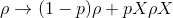

## Simulation

Cirq comes with built in Python simulators for testing
small circuits.  The two main types of simulations that Cirq
supports are pure state and mixed state.
There are two variations of simulators for pure state simulations.
One works for generic
gates that implement their unitary matrix: ``cirq.Simulator``
and the other is customized for the native gate set
of Google's Xmon hardware ``cirq.google.XmonSimulator``.
This later simulator can shard its simulation  across
different processes/threads to take advantage of
multiple cores/CPUs.  Depending on your local computer
architecture, one or the other of these may be faster.
We recommend starting with ``cirq.Simulator``.  Mixed state
simulators are supported by ``cirq.DensityMatrixSimulator``.

The names *pure state simulator* and *mixed state
simulators* refers to the fact that these simulations are
for quantum circuits; including unitary, measurements, and noise
that keeps the evolution in a pure state or a mixed state.
In other words, there are some noisy evolutions
that are supported by the pure state simulator as long as they
preserve the purity of the state.

### Introduction to pure state simulation

Here is a simple circuit
```python
import cirq

q0 = cirq.GridQubit(0, 0)
q1 = cirq.GridQubit(1, 0)

def basic_circuit(meas=True):
    sqrt_x = cirq.X**0.5
    yield sqrt_x(q0), sqrt_x(q1)
    yield cirq.CZ(q0, q1)
    yield sqrt_x(q0), sqrt_x(q1)
    if meas:
        yield cirq.measure(q0, key='q0'), cirq.measure(q1, key='q1')

circuit = cirq.Circuit()
circuit.append(basic_circuit())

print(circuit)
# prints
# (0, 0): ───X^0.5───@───X^0.5───M('q0')───
#                    │
# (1, 0): ───X^0.5───@───X^0.5───M('q1')───
```

We can simulate this by creating a ``cirq.Simulator`` and
passing the circuit into its ``run`` method:
```python
from cirq import Simulator
simulator = Simulator()
result = simulator.run(circuit)

print(result)
# prints something like
# q0=1 q1=1
```
Run returns an ``TrialResult``.  As you can see the result
contains the result of any measurements for the simulation run.

The actual measurement results here depend on the seeding
``numpy``s random seed generator. (You can set this using
``numpy.random_seed``) Another run, can result in a different
set of measurement results:
```python
result = simulator.run(circuit)

print(result)
# prints something like
# q0=1 q1=0
```

The simulator is designed to mimic what running a program
on a quantum computer is actually like.  In particular the
``run`` methods (``run`` and ``run_sweep``) on the simulator
do not give access to the wave function of the quantum computer
(since one doesn't have access to this on the actual quantum
hardware).  Instead the ``simulate`` methods (``simulate``,
``simulate_sweep``, ``simulate_moment_steps``) should be used
if one wants to debug the circuit and get access to the full
wave function:
```python
import numpy as np
circuit = cirq.Circuit()
circuit.append(basic_circuit(False))    
result = simulator.simulate(circuit, qubit_order=[q0, q1])

print(np.around(result.final_state, 3))
# prints
# [0.5+0.j 0. +0.5j 0. +0.5j 0.5+0.j]
```

Note that the simulator uses numpy's ``float32`` precision
(which is ``complex64`` for complex numbers) by default,
but that the simulator can take in a a dtype of np.complex128
if higher precision is needed.

### Qubit and Amplitude Ordering

The `qubit_order` argument to the simulator's `run` method
determines the ordering of some results, such as the
amplitudes in the final wave function. The `qubit_order`
argument is optional. When it is omitted, qubits are ordered
ascending by their name (i.e. what their `__str__` method returns).

The simplest `qubit_order` value you can provide is a list of
the qubits in the desired ordered. Any qubits from the circuit
that are not in the list will be ordered using the
default `__str__` ordering, but come after qubits that are in
the list. Be aware that all qubits in the list are included in
the simulation, even if they are not operated on by the circuit.

The mapping from the order of the qubits to the order of the
amplitudes in the wave function can be tricky to understand.
Basically, it is the same as the ordering used by `numpy.kron`:

```python
outside = [1, 10]
inside = [1, 2]
print(np.kron(outside, inside))
# prints
# [ 1  2 10 20]
```

More concretely, the `k`'th amplitude in the wave function
will correspond to the `k`'th case that would be encountered
when nesting loops over the possible values of each qubit.
The first qubit's computational basis values are looped over
in the outermost loop, the last qubit's computational basis
values are looped over in the inner-most loop, etc:

```python
i = 0
for first in [0, 1]:
    for second in [0, 1]:
        print('amps[{}] is for first={}, second={}'.format(i, first, second))
        i += 1
# prints
# amps[0] is for first=0, second=0
# amps[1] is for first=0, second=1
# amps[2] is for first=1, second=0
# amps[3] is for first=1, second=1
```

We can check that this is in fact the ordering with a
circuit that flips one qubit out of two:

```python
q_stay = cirq.NamedQubit('q_stay')
q_flip = cirq.NamedQubit('q_flip')
c = cirq.Circuit.from_ops(cirq.X(q_flip))

# first qubit in order flipped
result = simulator.simulate(c, qubit_order=[q_flip, q_stay])
print(abs(result.final_state).round(3))
# prints
# [0. 0. 1. 0.]

# second qubit in order flipped
result = simulator.simulate(c, qubit_order=[q_stay, q_flip])
print(abs(result.final_state).round(3))
# prints
# [0. 1. 0. 0.]
```

### Stepping through a Circuit

Often when debugging it is useful to not just see the end
result of a circuit, but to inspect, or even modify, the
state of the system at different steps in the circuit.  To
support this Cirq provides a method to return an iterator
over a ``Moment`` by ``Moment`` simulation.  This is the method
``simulate_moment_steps``:
```python
circuit = cirq.Circuit()
circuit.append(basic_circuit())    
for i, step in enumerate(simulator.simulate_moment_steps(circuit)):
    print('state at step %d: %s' % (i, np.around(step.state_vector(), 3)))
# prints something like
# state at step 0: [ 0.5+0.j   0.0+0.5j  0.0+0.5j -0.5+0.j ]
# state at step 1: [ 0.5+0.j   0.0+0.5j  0.0+0.5j  0.5+0.j ]
# state at step 2: [-0.5-0.j  -0.0+0.5j -0.0+0.5j -0.5+0.j ]
# state at step 3: [ 0.+0.j  0.+0.j -0.+1.j  0.+0.j]
```

The object returned by the ``moment_steps`` iterator is a
``StepResult``. This object has the state along with any
measurements that occurred **during** that step (so does
not include measurement results from previous ``Moments``).
In addition, the ``StepResult`` contains ``set_state()``
which  can be used to set the ``state``. One can pass a valid
full state to this method by passing a numpy array. Or
alternatively one can pass an integer and then the state
will be set lie entirely in the computation basis state
for the binary expansion of the passed integer.

### Monte Carlo simulations of noise

Some [noise](noise.md) models can be thought of as randomly
applying unitary evolutions with different probabilities. Such
noise models are amenable to Monte Carlo simulation. An example
of such a noise model is the bit flip channel. This channel
randomly applied either does nothing (identity) or applies
a Pauli `cirq.X` gate:



Lets see a use of this in a simulator
```python
q = cirq.NamedQubit('a')
circuit = cirq.Circuit.from_ops(cirq.bit_flip(p=0.2)(q), cirq.measure(q))
simulator = cirq.Simulator()
result = simulator.run(circuit, repetitions=100)
print(result.histogram(key='a'))
# prints something like
# Counter({1: 17, 0: 83})
```
As expected, the bit is flipped about 20 percent of the time.

Channels that support this sort of evolution implement the
`SupportsMixture` protocol.  Also note that this functionality
is currently only supported in the pure state simulator and
not in the density state simulator.  If the mixed state simulator
encounters a mixture, it will treat it as a general channel.

### XmonSimulator

In addition to ``cirq.Simulator`` there is also a simulator
which is specialized to the Google native gate set. In
particular this simulator is specialized to use the
``CZPowGate``, ``MeasurementGate``, ``PhasedXPowGate``,
``XPowGate``, ``YPowGate``, and the ``ZPowGate``. This
simulator can be configured to use processes or threads,
and depending on your local computing architecture may
sometimes be faster or slower that ``cirq.Simulator``.

### Gate sets

The ``XmonSimulator`` is designed to work with operations that
are either a ``GateOperation`` applying a supported gate
(such as `cirq.CZ`), a composite operation that implements
`_decompose_`, or a 1-qubit or 2-qubit operation that
returns a unitary matrix from its `_unitary_` method.

So if you are implementing a custom gate, there are two options
for getting it to work with the simulator:
* Implement a `_decompose_` method that returns supported gates
(or gates that decompose into supported gates).
* If the operation applies to two or fewer qubits, implement a
`_unitary_` method that returns the operation's matrix.

### Parameterized Values and Studies

In addition to circuit gates with fixed values, Cirq also
supports gates which can have ``Symbol`` value (see
[Gates](gates.md)). These are values that can be resolved
at *run-time*. For simulators these values are resolved by
providing a ``ParamResolver``.  A ``ParamResolver`` provides
a map from the ``Symbol``'s name to its assigned value.

```python
import sympy
rot_w_gate = cirq.X**sympy.Symbol('x')
circuit = cirq.Circuit()
circuit.append([rot_w_gate(q0), rot_w_gate(q1)])
for y in range(5):
    resolver = cirq.ParamResolver({'x': y / 4.0})
    result = simulator.simulate(circuit, resolver)
    print(np.round(result.final_state, 2))
# prints something like
# [1.  +0.j  0.+0.j   0.+0.j    0.  +0.j]
# [0.85+0.j  0.-0.35j 0.-0.35j -0.15+0.j]
# [0.5 +0.j  0.-0.5j  0.-0.5j  -0.5 +0.j]
# [0.15+0.j  0.-0.35j 0.-0.35j -0.85+0.j]
# [0.  +0.j  0.-0.j   0.-0.j   -1.  +0.j]
```
Here we see that the ``Symbol`` is used in two gates, and then the resolver
provide this value at run time.

Parameterized values are most useful in defining what we call a
``Study``.  A ``Study`` is a collection of trials, where each
trial is a run with a particular set of configurations and which
may be run repeatedly.  Running a study returns one
``TrialContext`` and ``TrialResult`` per set of fixed parameter
values and repetitions (which are reported as the ``repetition_id``
in the ``TrialContext`` object).  Example:
```python
resolvers = [cirq.ParamResolver({'x': y / 2.0}) for y in range(3)]
circuit = cirq.Circuit()
circuit.append([rot_w_gate(q0), rot_w_gate(q1)])
circuit.append([cirq.measure(q0, key='q0'), cirq.measure(q1, key='q1')])
results = simulator.run_sweep(program=circuit,
                              params=resolvers,
                              repetitions=2)
for result in results:
    print(result)
# prints something like
# repetition_id=0 x=0.0 q0=0 q1=0
# repetition_id=1 x=0.0 q0=0 q1=0
# repetition_id=0 x=0.5 q0=0 q1=1
# repetition_id=1 x=0.5 q0=1 q1=1
# repetition_id=0 x=1.0 q0=1 q1=1
# repetition_id=1 x=1.0 q0=1 q1=1
```
where we see that different repetitions for the case that the
qubit has been rotated into a superposition over computational
basis states yield different measurement results per run.
Also note that we now see the use of the ``TrialContext`` returned
as the first tuple from ``run``: it contains the ``param_dict``
describing what values were actually used in resolving the ``Symbol``s.

TODO(dabacon): Describe the iterable of parameterized resolvers
supported by Google's API.

### XmonSimulator Configurations and Options

The xmon simulator also contain some extra configuration
on the simulate commands. One of these is ``initial_state``.  
This can be passed the full wave function as a numpy array, or
the initial state as the binary expansion of a supplied integer
(following the order supplied by the qubits list).

A simulator itself can also be passed ``Options`` in it's constructor.
These options define some configuration for how the simulator runs.
For the xmon simulator, these include

> **num_shards**: The simulator works by sharding the wave function
over this many shards. If this is not a power of two, the
smallest power of two less than or equal to this number will
be used. The sharding shards on the first log base
2 of this number qubit's state. When this is not set the
simulator will use the number of cpus, which tends to max
out the benefit of multi-processing.

> **min_qubits_before_shard**: Sharding and multiprocessing does
not really help for very few number of qubits, and in fact can
hurt because processes have a fixed (large) cost in Python.
This is the minimum number of qubits that are needed before the
simulator starts to do sharding. By default this is 10.


### Mixed state simulations

In addition to pure state simulation, Cirq also supports
simulation of mixed states. Even though this simulator is not
as efficient as the pure state simulators, they allow
for a larger class of noisy circuits to be run as well as
keeping track of the simulation's density matrix. This
later fact can allow for more exact simulations (for example
the pure state simulator's Monte Carlo simulation only
allows sampling from the density matrix, not explicitly giving
the entries of the density matrix like the mixed state simulator
can do). Mixed state simulation is supported by the
``cirq.DensityMatrixSimulator`` class.

Here is a simple example of simulating a channel using the
mixed state simulator
```python
q = cirq.NamedQubit('a')
circuit = cirq.Circuit.from_ops(cirq.H(q), cirq.amplitude_damp(0.2)(q), cirq.measure(q))
simulator = cirq.DensityMatrixSimulator()
result = simulator.run(circuit, repetitions=100)
print(result.histogram(key='a'))
# prints something like
# Counter({0: 61, 1: 39})
```
We create a state in an equal superposition of 0 and 1
then apply amplitude damping which takes 1 to 0 with
something like a probability of 0.2. We see that instead of
about 50 percent of the timing being in 0, about 20 percent
of the 1 has been converted into 0, so we end up with total
around 60 percent in the 0 state.

Like the pure state simulators, the mixed state simulator
supports ``run`` and ``run_sweeps`` methods. The
``cirq.DensityMatrixSimulator`` also supports getting access
to the density matrix of the circuit at the end of simulating
the circuit, or when stepping through the circuit.  These are
done by the ``simulate`` and ``simulate_sweep`` methods, or,
for stepping through the circuit, via the ``simulate_moment_steps``
method.   For example, we can simulate creating an equal
superposition followed by an amplitude damping channel with a
gamma of 0.2 by
```
q = cirq.NamedQubit('a')
circuit = cirq.Circuit.from_ops(cirq.H(q), cirq.amplitude_damp(0.2)(q))
simulator = cirq.DensityMatrixSimulator()
result = simulator.simulate(circuit)
print(np.around(result.final_density_matrix, 3))
# prints
# [[0.6  +0.j 0.447+0.j]
#  [0.447+0.j 0.4  +0.j]]
```
We see that we have access to the density matrix at the
end of the simulation via ``final_density_matrix``.
