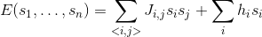
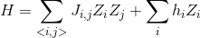
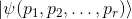

# Tutorial

In this tutorial we will go from knowing nothing about Cirq to creating a
[quantum variational algorithm](https://arxiv.org/abs/1304.3061).
Note that this tutorial isn't a quantum computing 101 tutorial,
we assume familiarity of quantum computing at about the level of
the textbook "Quantum Computation and Quantum Information" by
Nielsen and Chuang. For a more conceptual overview see the
[conceptual documentation](table_of_contents.md).

To begin, please follow the instructions for [installing Cirq](install.md).

### Background: Variational quantum algorithms

The [variational method](https://en.wikipedia.org/wiki/Variational_method_(quantum_mechanics))
in quantum theory is a classical method for finding low energy states
of a quantum system. The rough idea of this method is that one defines
a trial wave function (sometimes called an ansatz) as a function
of some parameters, and then one finds the values of these
parameters that minimize the expectation value of the energy
with respect to these parameters. This minimized ansatz is then
an approximation to the lowest energy eigenstate, and
the expectation value serves as an upper bound on the energy of the
ground state.

In the last few years (see [arXiv:1304.3061](https://arxiv.org/abs/1304.3061)
and [arXiv:1507.08969](https://arxiv.org/abs/1507.08969) for example), it
has been realized that quantum computers can mimic the
classical technique and that a quantum computer does so with certain
advantages.  In particular, when one applies the classical variational
method to a system of `n` qubits, an exponential number (in `n`)
of complex numbers are necessary to generically represent the
wave function of the system.  However with a quantum computer one
can directly produce this state using a parameterized quantum
circuit, and then by repeated measurements estimate the expectation
value of the energy.

This idea has led to a class of algorithms known as variational quantum
algorithms. Indeed this approach is not just limited to finding low
energy eigenstates, but minimizing any objective function that can
be expressed as a quantum observable. It is an open question to identify
under what conditions these quantum variataional algorithms will succeed,
and exploring this class of algorithms is a key part of research
for [noisy intermediate scale quantum computers](https://arxiv.org/abs/1801.00862).

The classical problem we will focus on is the 2D +/- Ising model with
transverse field ([ISING](http://iopscience.iop.org/article/10.1088/0305-4470/15/10/028/meta)).
This problem is NP-complete.  So it is highly unlikely that
quantum computers will be able to efficiently solve it
across all instances.  Yet this type of problem is illustrative of
the general class of problems that Cirq is designed to tackle.

Consider the energy function



where here each s<sub>i</sub>, J<sub>i,j</sub>, and h<sub>i</sub> are either 
+1 or -1.  Here each index i is associated with a bit on a square lattice,
and the <i,j> notation means sums over neighboring bits on this lattice.
The problem we would like to solve is, given J<sub>i,j</sub>, and h<sub>i</sub>,
find an assignment of s<sub>i</sub> values that minimize E.

How does a variational quantum algorithm work for this? One approach is
to consider `n` qubits and associate them with each of the bits in the
classical problem.  This maps the classical problem onto the quantum problem
of minimizing the expectation value of the observable



Then one defines a set of parameterized quantum circuits, i.e. a 
quantum circuit where the gates (or more general quantum operations)
are parameterized by some values.  This produces an ansatz state



where p<sub>i</sub> are the parameters that produce this state
(here we assume a pure state, but mixed states are of course
possible).

The variational algorithm then works by noting that one
can obtain the value of the objective function for a 
given ansatz state by 
1. Prepare the ansatz state.
2. Make a measurement which samples from some terms in H.
3. Goto 1.

Note that one cannot always measure H directly (without
the use of quantum phase estimation).  So one often relies
on the linearity of expectation values to measure parts of
H in step 2. One always needs to repeat the measurements to
obtain an estimate of the expectation value. How many measurements
needed to achieve a given accuracy is beyond the scope of 
this tutorial, but Cirq can help investigate this question.

The above shows that one can use a quantum computer to 
obtain estimates of the objective function for the ansatz.
This can then be used in an outer loop to try to 
obtain parameters for the the lowest value of the
objective function. For these values, one can then use
that best ansatz to produce samples of solutions to the problem
which obtain a hopefully good approximation for the 
lowest possible value of the objective function.

### Create a circuit on a Grid

To build the above variational quantum algorithm using Cirq,
one begins by building the appropriate [circuit](circuits.md).
In Cirq circuits are represented either by a `Circuit` object
or a `Schedule` object.  `Schedule`s offer more control over
quantum gates and circuits at the timing level, which we do not
need, so here we will work with `Circuit`s instead.

Conceptually: a `Circuit` is a collection of ``Moments``. A
`Moment` is a collection of ``Operations`` that all act during
the same abstract time slice. An `Operation` is a an effect
that operates on a specific subset of ``Qubits``.
The most common type of `Operation` is a `Gate` applied
to several qubits (a `GateOperation`). The following diagram
should help illustrate these concepts.


See the [conceptual documentation](circuits.md) for more 
details on these classes. Because the problem we have 
defined has a natural structure on a grid, we will use 
Cirq's built in `GridQubit`s as our qubits.
We will demonstrate some of how this works in an 
interactive Python environment, the following code can
be run in series in a Python environment where you have
Cirq installed.

Let's begin by talking about our qubits. In an interactive
Python environment run
```python
import cirq

# define the length of the grid.
length = 3
# define qubits on the grid.
qubits = [cirq.GridQubit(i, j) for i in range(length) for j in range(length)]
print(qubits)
# prints 
# [cirq.GridQubit(0, 0), cirq.GridQubit(0, 1), cirq.GridQubit(0, 2), cirq.GridQubit(1, 0), cirq.GridQubit(1, 1), cirq.GridQubit(1, 2), cirq.GridQubit(2, 0), cirq.GridQubit(2, 1), cirq.GridQubit(2, 2)]
```
Here we see that we've created a bunch of `GridQubit`s. 
`GridQubit`s implement the `QubitId` class, which just means
that they are equatable and hashable. `GridQubit`s in addition
have a row and column, indicating their position on a grid.

Now that we have some qubits, let us construct a `Circuit` on these qubits.
For example, suppose we want to apply the Hadamard gate `H` to
every qubit whose row index plus column index is even and an `X`
gate to every qubit whose row index plus column index is odd.  To
do this we write
```python
circuit = cirq.Circuit()
circuit.append(cirq.H.on(q) for q in qubits if (q.row + q.col) % 2 == 0)
circuit.append(cirq.X(q) for q in qubits if (q.row + q.col) % 2 == 1)
print(circuit)
# prints
# (0, 0): ───H───────
#
# (0, 1): ───────X───
#
# (0, 2): ───H───────
#
# (1, 0): ───────X───
#
# (1, 1): ───H───────
# 
# (1, 2): ───────X───
# 
# (2, 0): ───H───────
#
# (2, 1): ───────X───
#
# (2, 2): ───H───────
```
One thing to notice here.  First `cirq.X` is a `Gate` object. There
are many different gates supported by Cirq. A good place to look
at gates that are defined is in [common_gates.py](/cirq/ops/common_gates.py).
One common confusion to avoid is the difference between a gate class 
and a gate object (which is an instantiation of a class).  The second is that gate
objects are transformed into `Operation`s (technically `GateOperation`s)
via either the method `on(qubit)` or, as we see for the `X` gates, via simply
applying the gate to the qubits `(qubit)`. Here we only apply single
qubit gates, but a similar pattern applies for multiple qubit gates with a 
sequence of qubits as parameters.

Another thing one notices about the above circuit is that the circuit has
staggered gates. This is because the way in which we have applied the
gates has created two `Moment`s.
```python
for i, m in enumerate(circuit):
    print('Moment {}: {}'.format(i, m))
# prints 
# Moment 0: H((0, 0)) and H((0, 2)) and H((1, 1)) and H((2, 0)) and H((2, 2))
# Moment 1: X((0, 1)) and X((1, 0)) and X((1, 2)) and X((2, 1))
```
Here we see that we can iterate over a `Circuit`'s `Moment`s. The reason
that two `Moment`s were created was that the `append` method uses an
`InsertStrategy` of `NEW_THEN_INLINE`. `InsertStrategy`s describe
how new insertions into `Circuit`s place their gates. Details of these
strategies can be found in the [circuit documentation](circuits.md).  If
we wanted to insert the gates so that they form one `Moment`, we could 
instead use the `EARLIEST` insertion strategy:
```python
circuit = cirq.Circuit()
circuit.append([cirq.H.on(q) for q in qubits if (q.row + q.col) % 2 == 0],
               strategy=cirq.InsertStrategy.EARLIEST)
circuit.append([cirq.X(q) for q in qubits if (q.row + q.col) % 2 == 1],
               strategy=cirq.InsertStrategy.EARLIEST)
print(circuit)
# (0, 0): ───H───
#
# (0, 1): ───X───
#
# (0, 2): ───H───
#
# (1, 0): ───X───
#
# (1, 1): ───H───
#
# (1, 2): ───X───
#
# (2, 0): ───H───
#
# (2, 1): ───X───
#
# (2, 2): ───H───
```
We now see that we have only one moment, as the `X` gates have been slid
over to act at the earliest `Moment` they can.

### Creating the Ansatz

If you look closely at the circuit creation code above you will see that
we applied the `append` method to both a `generator` and a `list` (recall that
in Python one can use generator comprehensions in method calls).
Inspecting the [code](/cirq/circuits/circuit.py) for append one sees that
the append method generally takes an `OP_TREE` (or a `Moment`).  What is
an `OP_TREE`?  It is not a class but a contract.  Roughly an `OP_TREE`
is anything that can be flattened, perhaps recursively, into a list
of operations, or into a single operation. Examples of an `OP_TREE` are
* A single `Operation`.
* A list of `Operation`s.
* A tuple of `Operation`s.
* A list of a list of `Operations`s.
* A generator yielding `Operations`. 

This last case yields a nice pattern for defining sub-circuits / layers:
define a function that takes in the relevant parameters and then
yields the operations for the sub circuit and then this can be appended
to the Circuit: 
```python
def rot_x_layer(length, half_turns):
    """Yields X rotations by half_turns on a square grid of given length."""
    rot = cirq.RotXGate(half_turns=half_turns)
    for i in range(length):
        for j in range(length):
            yield rot(cirq.GridQubit(i, j))
        
circuit = cirq.Circuit()
circuit.append(rot_x_layer(2, 0.1))
print(circuit)
# prints
# (0, 0): ───X^0.1───
#
# (0, 1): ───X^0.1───
#
# (1, 0): ───X^0.1───
#
# (1, 1): ───X^0.1───
```
Another important concept here is that the rotation gate is
specified in "half turns". For a rotation about X this is the
gate cos(half_turns * pi) I + i sin(half_turns * pi) X.

There is a lot of freedom defining a variational ansatz.
Here we will do a variation on a [QOAO strategy](https://arxiv.org/abs/1411.4028)
and define an anstaz related to he problem we are trying to solve.

First we need to choose how the instances of the
problem are represented.  These are the values J and h in the
Hamiltonian definition.  We will represent these as two dimensional
arrays (lists of lists).  For J we will use two such lists,
one for the row links and one for the column links.

Here is code that we can use to generate random problem
instances
```python
import random
def rand2d(rows, cols):
    return [[random.choice([+1, -1]) for _ in range(rows)] for _ in range(cols)]

def random_instance(length):
    # transverse field terms
    h = rand2d(length, length)
    # links within a row
    jr = rand2d(length, length - 1)
    # links within a column
    jc = rand2d(length - 1, length)
    return (h, jr, jc)
    
h, jr, jc = random_instance(3)
print('transverse fields: {}'.format(h))
print('row j fields: {}'.format(jr))
print('column j fields: {}'.format(jc))
# prints something like
# transverse fields: [[-1, 1, -1], [1, -1, -1], [-1, 1, -1]]
# row j fields: [[1, 1, -1], [1, -1, 1]]
# column j fields: [[1, -1], [-1, 1], [-1, 1]]
```
where the actual values will be different for an individual
run because they are using `random.choice`.

Given this definition of the problem instance we can
now introduce our ansatz.  Our ansatz will consist
of one step of a circuit made up of
1. Apply a RotXGate for the same parameter for all qubits.
This is the method we have written above.
2. Apply a RotZGate for the same parameter for all qubits
where the transverse field term h is +1.
```python
def rot_z_layer(h, half_turns):
    """Yields Z rotations by half_turns conditioned on the field h."""
    gate = cirq.RotZGate(half_turns=half_turns)
    for i, h_row in enumerate(h):
        for j, h_ij in enumerate(h_row):
            if h_ij == 1:
                yield gate(cirq.GridQubit(i, j))
```
3. Apply a Rot11Gate for the same parameter between all
qubits where the coupling field term J is +1. If the field
is -1 apply Rot11Gate conjugated by X gates on all qubits.
```python
def rot_11_layer(jr, jc, half_turns):
    """Yeilds rotations about |11> conditioned on the jr and jc fields."""
    gate = cirq.Rot11Gate(half_turns=half_turns)    
    for i, jr_row in enumerate(jr):
        for j, jr_ij in enumerate(jr_row):
            if jr_ij == -1:
                yield cirq.X(cirq.GridQubit(i, j))
                yield cirq.X(cirq.GridQubit(i + 1, j))
            yield gate(cirq.GridQubit(i, j),
                       cirq.GridQubit(i + 1, j))
            if jr_ij == -1:
                yield cirq.X(cirq.GridQubit(i, j))
                yield cirq.X(cirq.GridQubit(i + 1, j))
            
    for i, jc_row in enumerate(jc):
        for j, jc_ij in enumerate(jc_row):
            if jc_ij == -1:
                yield cirq.X(cirq.GridQubit(i, j))
                yield cirq.X(cirq.GridQubit(i, j + 1))
            yield gate(cirq.GridQubit(i, j),
                       cirq.GridQubit(i, j + 1))
            if jc_ij == -1:
                yield cirq.X(cirq.GridQubit(i, j))
                yield cirq.X(cirq.GridQubit(i, j + 1))
```

Putting this together we can create a step that uses just
three parameters. The code to do this uses the generator
for each of the layers (note to advanced Python users that
this code is not a bug in using yield due to the auto
flattening of the OP_TREE concept. Normally one would want
to use `yield from` here, but this is not necessary):
```python               
def one_step(h, jr, jc, x_half_turns, h_half_turns, j_half_turns):
    length = len(h)
    yield rot_x_layer(length, x_half_turns)
    yield rot_z_layer(h, h_half_turns)
    yield rot_11_layer(jr, jc, j_half_turns)

h, jr, jc = random_instance(3)

circuit = cirq.Circuit()    
circuit.append(one_step(h, jr, jc, 0.1, 0.2, 0.3),
               strategy=cirq.InsertStrategy.EARLIEST)
print(circuit)
# prints something like
# (0, 0): ───X^0.1───────────@───────X───────────────────────────────@───────X───────────────────────────────
#                            │                                       │
# (0, 1): ───X^0.1───Z^0.2───┼───────@───────────────────────X───────@^0.3───X───X───────@───────X───────────
#                            │       │                                                   │
# (0, 2): ───X^0.1───Z^0.2───┼───────┼───────@───────────────X───────────────────────────@^0.3───X───────────
#                            │       │       │
# (1, 0): ───X^0.1───────────@^0.3───┼───────┼───────@───────X───────────────────────────@───────X───────────
#                                    │       │       │                                   │
# (1, 1): ───X^0.1───Z^0.2───────────@^0.3───┼───────┼───────X───────@───────X───X───────@^0.3───X───@───────
#                                            │       │               │                               │
# (1, 2): ───X^0.1───Z^0.2───────────────────@^0.3───┼───────@───────┼───────────────────────────────@^0.3───
#                                                    │       │       │
# (2, 0): ───X^0.1───────────────────────────────────@^0.3───┼───────┼───────────@───────────────────────────
#                                                            │       │           │
# (2, 1): ───X^0.1───Z^0.2───────────X───────────────────────┼───────@^0.3───X───@^0.3───@───────────────────
#                                                            │                           │
# (2, 2): ───X^0.1───Z^0.2───────────────────────────────────@^0.3───────────────────────@^0.3───────────────
```
Here we see that we have chosen particular parameter
values (0.1, 0.2, 0.3).

### Simulation

Now let's see how to simulate the circuit corresponding
to creating our ansatz.  In Cirq the simulators make a distinction
between a "run" and a "simulation". A "run" only allows for a
simulation that mimics the actual quantum hardware.  For example,
it does not allow for access to the amplitudes of the wave function
of the system, since that is not experimentally accessible.
"Simulate" commands, however, are more broad and allow different forms
of simulation.  When prototyping small circuits it is useful to
execute "simulate" methods, but one should be wary of relying on
them when run against actual hardware.

Currently Cirq ships with a simulator tied strongly to the gate
set of the Google xmon architecture.  However, for convenience,
the simulator attempts to automatically convert unknown
operations into XmonGates (as long as the operation specifies
a matrix or a decomposition into XmonGates). This can in
principle allows us to simulate any circuit that has gates
that implement one and two qubit  `KnownMatrix` gates.
Future releases of Cirq will expand these simulators.

Because the simulator is tied to the xmon gate set, the simulator
lives, in contrast to core Cirq, in the `cirq.google` module.
To run a simulation of the full circuit we simply create a
simulator, and pass the circuit to the simulator.

```python
simulator = cirq.google.XmonSimulator()
circuit = cirq.Circuit()    
circuit.append(one_step(h, jr, jc, 0.1, 0.2, 0.3))
circuit.append(cirq.measure(*qubits, key='x'))
results = simulator.run(circuit, repetitions=100, qubit_order=qubits)
print(results.histogram(key='x'))
# prints something like
# Counter({0: 85, 128: 5, 32: 3, 1: 2, 4: 1, 2: 1, 8: 1, 18: 1, 20: 1})
```
Note that we have run the simulation 100 times and produced a
histogram of the counts of the measurement results.  What are the
keys in the histogram counter? Note that we have passed in
the order of the qubits. This ordering is then used to translate
the order of the measurement results to a register using a
[big endian](https://en.wikipedia.org/wiki/Endianness) representation.

For our optimization problem we will want to calculate the
value of the objective function for a given result run. One
way to do this is use the raw measurement data from the result
of `simulator.run`. Another way to do this is to provide to
the histogram a method to calculate the objective: this will then
be used as the key for the returned Counter.
```python
import numpy as np

def energy_func(length, h, jr, jc):
    def energy(measurements):
        # Reshape measurement into array that matches grid shape.
        meas_list_of_lists = [measurements[i * length:(i + 1) * length]
                              for i in range(length)]
        # Convert true/false to +1/-1.
        pm_meas = 1 - 2 * np.array(meas_list_of_lists).astype(np.int32)

        tot_energy = np.sum(pm_meas * h)
        for i, jr_row in enumerate(jr):
            for j, jr_ij in enumerate(jr_row):
                tot_energy += jr_ij * pm_meas[i, j] * pm_meas[i + 1, j]
        for i, jc_row in enumerate(jc):
            for j, jc_ij in enumerate(jc_row):
                tot_energy += jc_ij * pm_meas[i, j] * pm_meas[i, j + 1]
        return tot_energy
    return energy
print(results.histogram(key='x', fold_func=energy_func(3, h, jr, jc)))
# prints something like
# Counter({7: 79, 5: 12, -1: 4, 1: 3, 13: 1, -3: 1})
```
One can then calculate the expectation value over all repetitions
```python
def obj_func(result):
    energy_hist = result.histogram(key='x', fold_func=energy_func(3, h, jr, jc))
    return np.sum(k * v for k,v in energy_hist.items()) / result.repetitions
print('Value of the objective function {}'.format(obj_func(results)))
# prints something like
# Value of the objective function 6.2
```

### Parameterizing the Ansatz

Now that we have constructed a variational ansatz and shown how to simulate
it using Cirq, we can now think about optimizing the value. On quantum
hardware one would most likely want to have the optimization code as close
to the hardware as possible.  As the classical hardware that is allowed to
inter-operate with the quantum hardware becomes better specified, this
language will be better defined.  Without this specification, however,
Cirq also provides a useful concept for optimizing the looping in many
optimization algorithms.  This is the fact that many of the value in
the gate sets can, instead of being specified by a float, be specified
by a `Symbol` and this `Symbol` can be substituted for a value specified
at execution time.

Luckily for us, we have written our code so that using parameterized
values is as simple as passing `Symbol` objects where we previously
passed float values.
```python
circuit = cirq.Circuit()
alpha = cirq.Symbol('alpha')
beta = cirq.Symbol('beta')
gamma = cirq.Symbol('gamma')
circuit.append(one_step(h, jr, jc, alpha, beta, gamma))
circuit.append(cirq.measure(*qubits, key='x'))
print(circuit)
# prints something like
# (0, 0): ───X^alpha────────────@─────────────────────────────────────────────────────X─────────────@─────────X───────────────────────────────────────────────────────M('x')───
#                               │                                                                   │                                                                 │
# (0, 1): ───X^alpha───Z^beta───┼─────────@───────────────────────────────────────────X─────────────@^gamma───X───X───@─────────X─────────────────────────────────────M────────
#                               │         │                                                                           │                                               │
# (0, 2): ───X^alpha───Z^beta───┼─────────┼─────────@─────────────────────────────────────────────────────────────X───@^gamma───X─────────────────────────────────────M────────
#                               │         │         │                                                                                                                 │
# (1, 0): ───X^alpha────────────@^gamma───┼─────────┼─────────@─────────────────────────────────────────────────────────────────X───@─────────X───────────────────────M────────
#                                         │         │         │                                                                     │                                 │
# (1, 1): ───X^alpha───Z^beta─────────────@^gamma───┼─────────┼─────────X───@─────────X─────────────────────────────────────────X───@^gamma───X───@───────────────────M────────
#                                                   │         │             │                                                                     │                   │
# (1, 2): ───X^alpha───Z^beta───────────────────────@^gamma───┼─────────────┼─────────────@───────────────────────────────────────────────────────@^gamma─────────────M────────
#                                                             │             │             │                                                                           │
# (2, 0): ───X^alpha──────────────────────────────────────────@^gamma───────┼─────────────┼───────────────────────────────────────────────────────@───────────────────M────────
#                                                                           │             │                                                       │                   │
# (2, 1): ───X^alpha───Z^beta───────────────────────────────────────────X───@^gamma───X───┼───────────────────────────────────────────────────────@^gamma───@─────────M────────
#                                                                                         │                                                                 │         │
# (2, 2): ───X^alpha───Z^beta─────────────────────────────────────────────────────────────@^gamma───────────────────────────────────────────────────────────@^gamma───M────────```
```
Note now that the circuit's gates are parameterized.

Parameters are specified at run time using a `ParamResolver` which is
which is just a dictionary from `Symbol` keys to runtime values. For example,
```python
resolver = cirq.ParamResolver({'alpha': 0.1, 'beta': 0.3, 'gamma': 0.7})
resolved_circuit = circuit.with_parameters_resolved_by(resolver)
```
resolves the parameters to actual values in the above circuit.

More usefully, Cirq also has the concept of a "sweep".  A sweep is
essentially a collection of parameter resolvers. This runtime information
is very useful when one wants to run many circuits for many different
parameter values.  Sweeps can be created to specify values directly
(this is one way to get classical information into a circuit), or
a variety of helper methods.  For example suppose we want to evaluate
our circuit over an equally spaced grid of parameter values.  We
can easily create this using `LinSpace`.
```python
sweep = (cirq.Linspace(key='alpha', start=0.1, stop=0.9, length=5)
         * cirq.Linspace(key='beta', start=0.1, stop=0.9, length=5)
         * cirq.Linspace(key='gamma', start=0.1, stop=0.9, length=5))
results = simulator.run_sweep(circuit, params=sweep, repetitions=100)
for result in results:
    print(result.params.param_dict, obj_func(result))
# prints something like
# OrderedDict([('alpha', 0.1), ('beta', 0.1), ('gamma', 0.1)]) 6.42
# OrderedDict([('alpha', 0.1), ('beta', 0.1), ('gamma', 0.30000000000000004)]) 6.48
# OrderedDict([('alpha', 0.1), ('beta', 0.1), ('gamma', 0.5)]) 6.44
# OrderedDict([('alpha', 0.1), ('beta', 0.1), ('gamma', 0.7000000000000001)]) 6.58
# OrderedDict([('alpha', 0.1), ('beta', 0.1), ('gamma', 0.9)]) 6.58
...
# OrderedDict([('alpha', 0.9), ('beta', 0.9), ('gamma', 0.7000000000000001)]) 0.76
# OrderedDict([('alpha', 0.9), ('beta', 0.9), ('gamma', 0.9)]) 0.94```
```

### Finiding the Minimum

Now we have all the code to we need to do a simple grid search
over values to find a minimal value.  Grid search is most definitely
not the best optimization algorithm, but is here simply illustrative.

```python
sweep_size = 10
sweep = (cirq.Linspace(key='alpha', start=0.0, stop=1.0, length=10)
         * cirq.Linspace(key='beta', start=0.0, stop=1.0, length=10)
         * cirq.Linspace(key='gamma', start=0.0, stop=1.0, length=10))
results = simulator.run_sweep(circuit, params=sweep, repetitions=100)

min = None
min_params = None
for result in results:
    value = obj_func(result)
    if min is None or value < min:
        min = value
        min_params = result.params
print('Minimum objective value is {}.'.format(min))
# prints something like
# Minimum objective value is -1.42.
```

We've created a simple variational quantum algorithm using Cirq.
Where to go next?  Perhaps you can play around with the above code
and work on analyzing the algorithms performance.  Add new parameterized
circuits and build an end to end program for analyzing these circuits.
Finally a good place to learn more about features of Cirq is to read
through the [conceptual documentation](table_of_contents.md).
